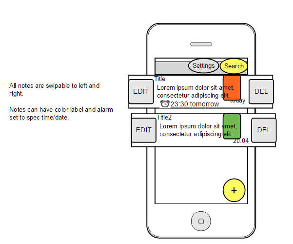
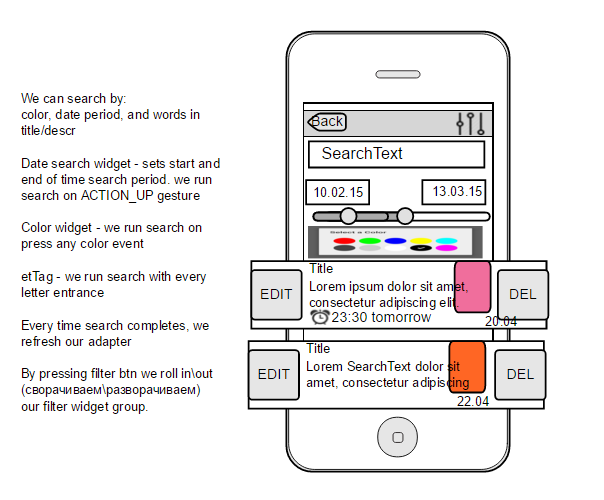
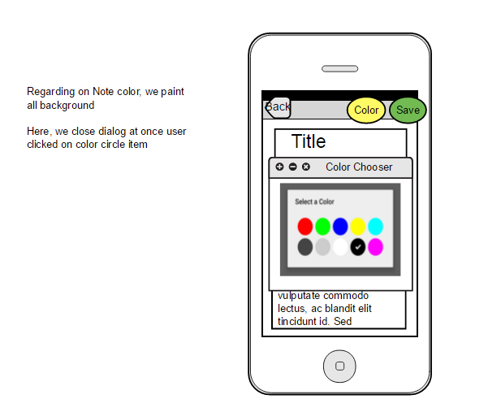
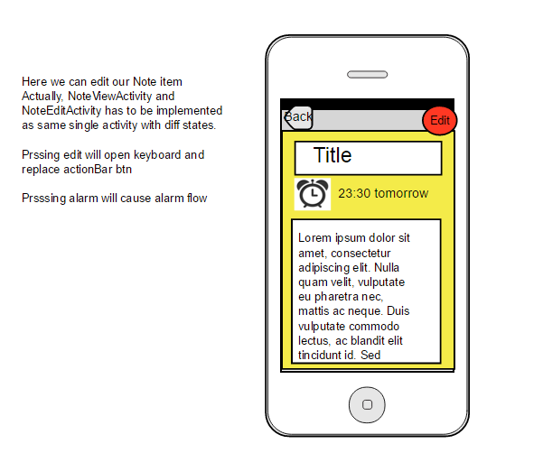

#Colorful Notes
Project is at the very beginning

Lets make easy colorful note managment app.

We should keep up to Moqups plan : https://moqups.com/arhangelstd@gmail.com/BROwHPgM

Main idea - 
**Each note has its color.** It acts like note tag - it simply group notes by colors.
We can search by color (colors are predefined, and can be configured throw settings)
Secon, we will have powerfull search, and swipable to left/right note elements

When we create note we can set color, title, descr and enable alarm clock to be fired when setted time will appear

Search is by date (start/end), by text (descr/title), color

RateActivity goes to Google Play only if mark is >= 4
if less, we just say "Thank you for your rating"

### Some moqup images

